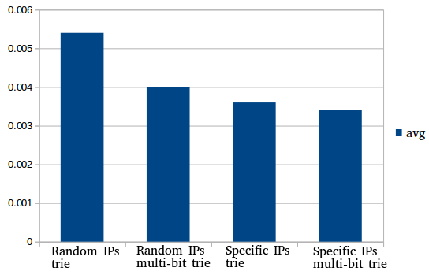

# Project 4:
## 1.

The algorithm seems to have linear complexity. Probably iptables just matches the packet against every rule.

## 2.
+ Put the most filtered IPs to the top of the ruleset. (For this configuration the results would be the same if the packet is not dropped anyway)
+ If there is a certain range of IPs which should be accepted, they can immediately be accepted instead of running them through all rules. (This would optimize the delay of definitely allowed packets to nearly 0 and not change the delay of every other packet
+ Change the mask to a smaller value. E.g. instead of writing a rule for every IP in range 4.4.0.0 - 4.4.255.255, you can write it as 4.4.0.0/16. In question 1 the 2 million rules blocked the range of IPs from 4.1.0.0 - 4.200.49.199. With 256 rules the same effect can be achieved, with a mask of 255.255.0.0. With this new set of rules the processing time goes down from an avg of 47.515ms with a derv of 7.368ms to an avg of 0.006ms with a derv of 0.003ms. 
+ Implementing rules with ipset in a hash:ip list where every list contains 50.000 rules speeds up the filtering process by a huge margin. The results of the tests with ipset are in the graph below. 

## 3.

The times do not measurably change, which means that bloomfilters execute in constant time. It is however noteworthy, that there is a decent amount of collisions and false negatives.
## 4.
The tests were done on a rule set of 400.000 rules. The rule set had to be kept low due to the low memory available on the PC that was used and a non optimal implementation.

The times go down from left to right, however only slightly.

The memory usage is very large and seems to be slightly larger for a trie, since the trie elements take up the majority of memory space.

# Project 3:
* 1:
It can never be said for sure that a Disassociation or Deauthentication frame come from a malicious actor. It can always be an error or two beacons miscommunicating. If say there is a barrage of Disassociation or Deauthentication, then most of them can be assumed to be malicious, but it can never be said definitely for a single one if it is malicious or not.
One scenario could be, that the beacon is transfering data to the device and while it is transfering a Deauthentication frame arrives. As just discussed, this could be an accident. If however the data continues to be transfered, the device seems not to be deauthenticated and it becomes clear, that the Deauthentication frame was faulty.
A policy can be designed to show, not when a frame is malicious (since we do not know that), but when it is faulty.
Rules when a Disassociation/Deauthentication packet is faulty:
+ When the beacon continues to communicate normally after the packet
+ When there was no authentication/association
+ When in a 802.11w packet the checksum in the end is not correct
Both of these things are hard to judge when in a live capture.
As another measure, a Disassociation/Deauthentication can be only allowed every X minutes, to prevent wifi jamming.

* 2:
The ARP replay attack detection works on basis of a general replay attack detection. Every packet is compared to a set of previously monitored packets. The rate at which a single packet (in which every bit of data is the same) can be received, without issuing an error is 500 packets per minute.

* 3:
WebWereld wrote in 2011, that in the Netherlands hacking Wifi and piggybacking were made legal.[1]
Interfering with a third parties data (deleting, damaging, changing, adding) is met with a maximum penalty of four years imprisonment.
Interference with systems (e.g. DOS Attack) and most unwanted interceptions of data are also illegal. Hacking into a computer is illegal, however a network is not a computer (According to Dutch jurisdiction), therefore hacking into a network is legal.[2]

[1]http://www.pcworld.com/article/222589/dutch_court_rules_wifi_hacking_now_legal.html, accessed 19/05/2017
[2]Electronic Journal of Comparitive Law vol 14.3, December 2010

* 4:
Yes. All addresses in the MAC Header of the packet are a part of the MIC calculation. If one of them is changed the MIC will also change. It is therefore not possible to change a packet in transit. 
In addition to this there is a sequence number of a packet, which also is included in the calculation. This helps prevent replay attacks, since the MIC for the same packet will be different if the sequence number is different. The sequence number is 48bit long, so the only way to replay a packet is to wait for 2^48 packets and then to inject the replay. This works since the sequence number is just incremented every packet.
All this is on the basis that the key has not been compromised.

* 5:

# Project 2:
* 1:
## ARP Request:
+ To broadcast address - NORMAL
+ To unicast/multicast address - NOTICE
## ARP Reply:
+ To broadcast/multicast address - ERROR
+ To unicast address - NORMAL
## ARP Gratuitous:
+ To broadcast address - NORMAL
+ To unicast/multicast address - ERROR
## ARP Reply/Gratuitous:
+ Binding to IP addresses having 255 in the last two integers(Broadcast) - ERROR
+ Binding to MAC broadcast address - ERROR
+ (Binding to IP addresses 224.0.0.0-239.255.255.255(Multicast) - ERROR)
+ (Binding to MAC addresses with 33-33-xx-xx-xx-xx(Multicast) - ERROR)
+ (Binding to MAC addresses with 01-00-5E-xx-xx-xx(Multicast) - ERROR)
+ Source MAC Address differs from binded to MAC address - NOTICE

* 2:
See Project02Structure.png

* 3:
See Program. Testable with testCap.pcap

* 4:

# Project 1:
* 1:
See program.

* 2:
Possibility 1: "tcp"
Possibility 2: "ip and tcp"

* 3:
See program.
